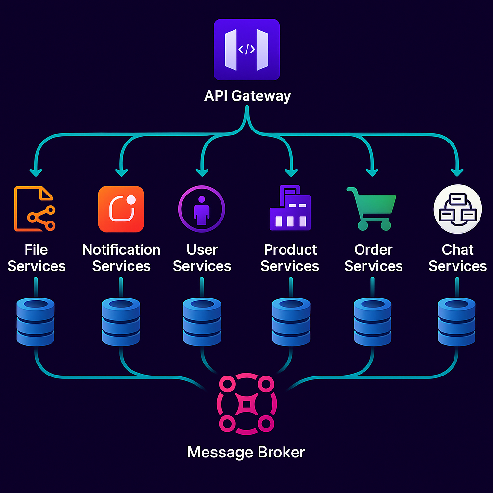

# (OPEN-COMMERCE) An E-Commerce Microservices Platform 🛍️


A Scalable, Distributed Online Shopping System

This project is a modern e-commerce platform built using microservices architecture where each core component operates as an independent service with its own database, communicating through RabbitMQ for seamless inter-service operations. Designed for high availability and scalability, the system handles everything from user management to order processing with efficiency and reliability.

<!--  -->


## Key Highlights

✔ Decoupled Architecture: Six independent services (User, Product, Order, Notification, File Storage, and API Gateway) ensure fault isolation and independent scalability.

✔ Event-Driven Communication: Services exchange messages via RabbitMQ, enabling asynchronous processing (e.g., order confirmation → inventory update → user notification).

✔ Centralized Storage: A dedicated File Storage Service manages all media (product images, user uploads) with a unified interface.

✔ Real-Time Capabilities: Users receive instant notifications (order updates, promotions) via the Notification Service.

✔ Robust API Layer: The API Gateway handles authentication, load balancing, and request routing while serving as the system’s single entry point

## 🌟 Services

| Service                  | Description                           |
| ------------------------ | ------------------------------------- |
| **User Service**         | Manages user accounts and profiles    |
| **Product Service**      | Handles product catalog and inventory |
| **Order Service**        | Processes orders and payments         |
| **Notification Service** | Sends real-time notifications         |
| **File Service**         | Manages file uploads and storage      |
| **API Gateway**          | Centralized API access and auth       |

## 🛠️ Tech Stack

- Backend: Node.js, TypeScript, Express
- Databases: PostgreSQL (one per service)
- Message Broker: RabbitMQ
- Caching: Redis
- Infrastructure: Docker, Docker Compose

## 🚀 Quick Start

#### Prerequisites

- Docker 20.10+
- Node.js 18+

```bash
# Clone the repository
git clone https://github.com/RydKrm/OpenCommerce
cd OpenCommerce

# Start all services
docker-compose up --build
```

## Why This Architecture?

- Scalability: Scale individual services (e.g., Product Service during sales) without affecting others.
- Resilience: Failure in one service (e.g., Notifications) doesn’t crash the entire system.
- Maintainability: Clear separation of concerns simplifies updates and debugging.
- Ideal for mid-to-large e-commerce businesses seeking a cloud-ready, modular solution that can evolve with their needs.

## Refined Use Cases

User Places an Order:

- API Gateway authenticates the request → Order Service processes payment → Product Service updates inventory → Notification Service alerts the user.

- Admin Uploads Product Images: File Storage Service saves images → Product Service updates metadata → Redis caches the new product data.
- Real-Time Review Notification: A product review (Product Service) triggers a RabbitMQ event → Notification Service emails the seller.
